- [PURPOSE](#purpose)
- [BACKUP FONCTIONALITY](#backup-fonctionality)
  - [CREATING THE BACKUP](#creating-the-backup)
  - [BACKUP CONTROL](#backup-control)
  - [LIST AVAILABLE BACKUPS](#list-available-backups)
  - [LIST THE CONTENTS OF BACKUPS](#list-the-contents-of-backups)
  - [NTDS RESTORE](#ntds-restore)
  - [OPENING THE NTDS FILE](#opening-the-ntds-file)
  - [RESTORATION VIA EXPORT](#restoration-via-export)
  - [BACKUP FUNCTIONALITY LIMITATIONS](#backup-functionality-limitations)
  - [ADVANTAGES OF THE BACKUP FEATURE](#advantages-of-the-backup-feature)
- [SNAPSHOT](#snapshot)
  - [ACTIVATE SNAPSHOTS](#activate-snapshots)
  - [CREATE A SNAPSHOT](#create-a-snapshot)
  - [LIST AVAILABLE SNAPSHOTS](#list-available-snapshots)
  - [MOUNTING A SNAPSHOT](#mounting-a-snapshot)
  - [RESTORE FROM SNAPSHOT](#restore-from-snapshot)
  - [SNAPSHOTS LIMITS](#snapshots-limits)
  - [BENEFITS OF SNAPSHOTS](#benefits-of-snapshots)
- [RECYCLE BIN](#recycle-bin)
  - [ADD RECYCLE BIN](#add-recycle-bin)
  - [USE RECYCLE BIN](#use-recycle-bin)
  - [RECYCLE BIN LIMITS](#recycle-bin-limits)
  - [RECYCLE BIN ADVANTAGES](#recycle-bin-advantages)
- [CONCLUSION](#conclusion)
- [Sources :](#sources-)

# PURPOSE
The purpose of this article is to show you that it is quite possible to back up and restore an AD in a granular way without spending thousands on third-party backup software.
Third-party software has advantages, but if you have a small infrastructure or a very limited budget, let's see how to do it.

# BACKUP FONCTIONALITY
We start by adding the backup functionality.

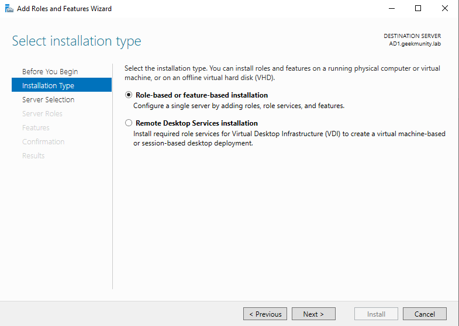

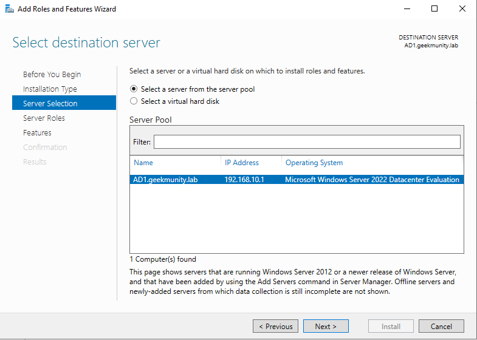

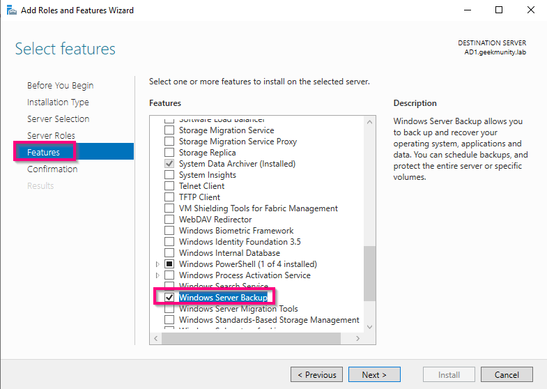

## CREATING THE BACKUP
* Open the command prompt as administrator.
* Enter: wbadmin start systemstatebackup -backuptarget:<Directory>

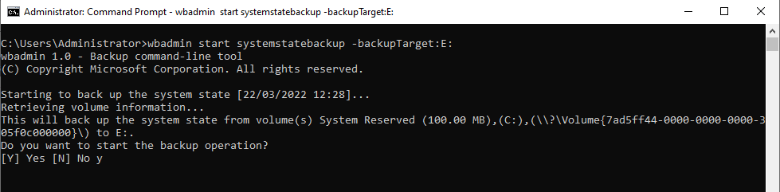

* Wait

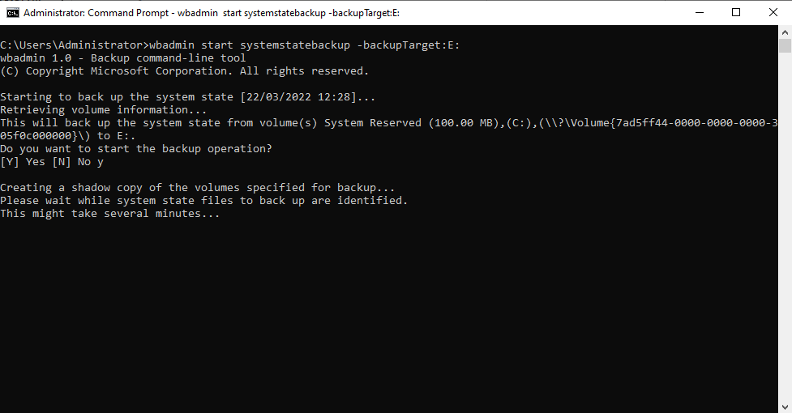

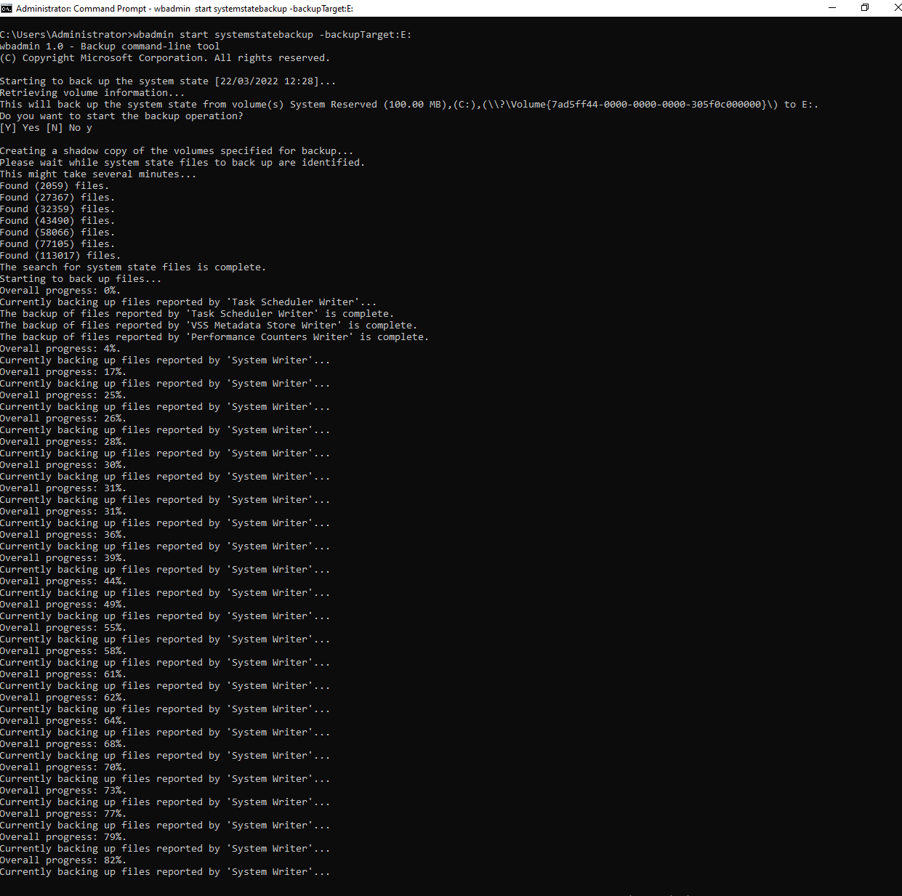

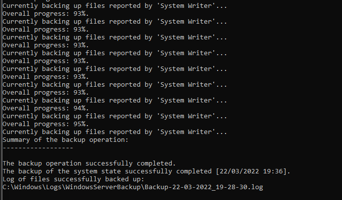

For an AD of several thousand objects, it takes about ten minutes.

## BACKUP CONTROL
* Go to the backup directory, in my case E:\WindowsImageBackup\NomServeur

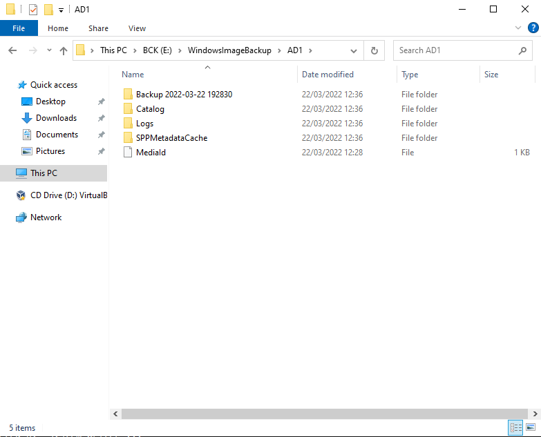

* Go to the Logs folder.
* View the Backup_Error file.

> With this log file, it is possible to generate alerts by either inspecting the size or the content.

## LIST AVAILABLE BACKUPS
* Open the command prompt as administrator.
* Enter : wbadmin get versions

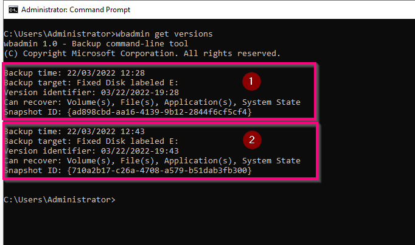

## LIST THE CONTENTS OF BACKUPS
* Open the command prompt as administrator.
* Enter: webadmin get items -version:Versionidentifier

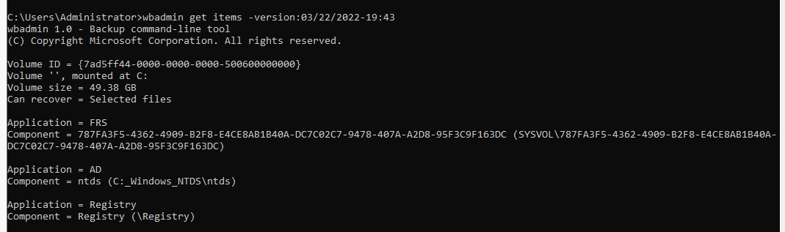

> We can see that our backup includes the Active Directory application and the ntds component, which allows a granular restoration of objects.

> As we made a backup of the system state, it is possible to restore the AD server completely via DSRM.

## NTDS RESTORE
* Open the command prompt as administrator.
* Enter: wbadmin start recovery -version:03/22/2022-19:43 -itemtype:App -items:AD -recoverytarget:E:\Restore\

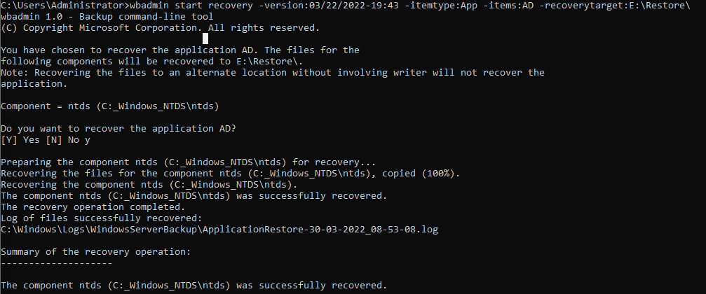

If we go to the restore folder, we can see that the ntds file is restored.

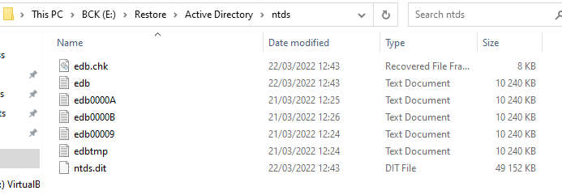

## OPENING THE NTDS FILE
To read the ntds file we will mount it using the dsamain command.

* Open the command prompt as administrator.
* Enter: dsamain -dbpath "E:\Restore\Active Directory\ntds\ntds.dit" -ldapport 2000

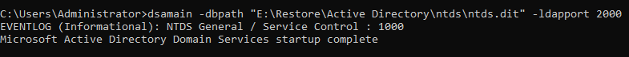

> The port is free, you just have to choose an unused one on the system to avoid possible conflicts.

* Open "Active Directory Users and computers".
* Select "Change domain controller".

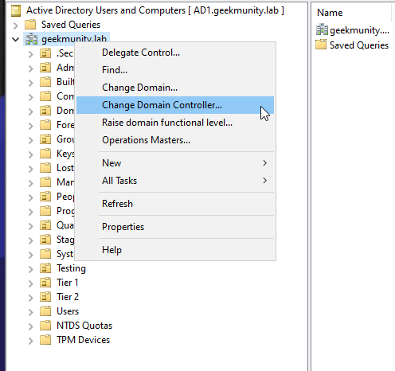

* Enter the restore information previously provided.

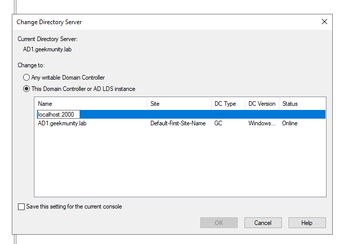

> The file is now readable, but not directly restorable. On the other hand, it can make it possible to compare the evolution of accounts.

## RESTORATION VIA EXPORT
In order to restore one or more accounts we will use the LDIFDE utility.

* Open the command prompt as administrator.
* Enter: ldifde -f E:\Restore\exportLEOLA.ldf -s localhost:2000 -r "CN=LEOLA_VALENTINE" -m

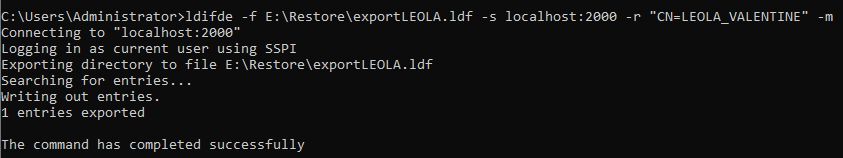

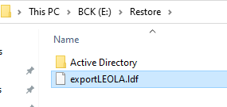

As with every restoration, we will make the account inactive before re-importing it.

* Open the file "exportLEOLA.ldf".
* Edit line "userAccountControl: ".
* Assign value 514.
* Open the command prompt as administrator.
* Enter: ldifde -i -f E:\Restore\exportLEOLA.ldf

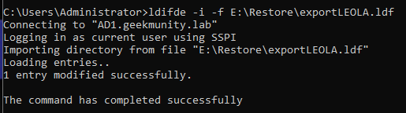

Now all that remains is to change the account password, because this type of restoration generates an account without a password.

## BACKUP FUNCTIONALITY LIMITATIONS
* Can be complicated to use in case of major restoration.
* Does not save all object attributes.
* Requires adding backup functionality.

## ADVANTAGES OF THE BACKUP FEATURE
* Allows the restoration of objects on the same AD or another (useful in the event of an incident).
* Allows full AD recovery via DSRM mode.

# SNAPSHOT
Available since Windows Server 2008, the snapshot functionality is close to the snapshots we are used to with VMs.

## ACTIVATE SNAPSHOTS
* Open the command prompt as administrator.
* Enter: ntdsutil
* Enter: activate instance ntds

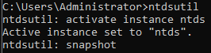

## CREATE A SNAPSHOT
* Open the command prompt as administrator.
* Enter: create

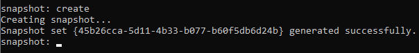

## LIST AVAILABLE SNAPSHOTS
* Open the command prompt as administrator.
* Enter: list all

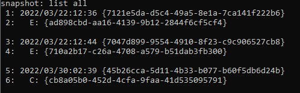

## MOUNTING A SNAPSHOT
* Open the command prompt as administrator.
* Enter the snapshot to remount (the number): mount X

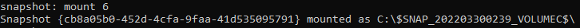

## RESTORE FROM SNAPSHOT
* Go to the SNAPSHOT folder C:\$SNAP_DATE_VOLUMEC$\Windows\NTDS

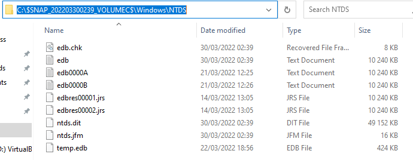

We note that the ntds.dit file is available, so all that remains is to repeat the same operation as in the previous chapter to perform the restoration.

## SNAPSHOTS LIMITS
* Requires thinking about doing snapshots on a regular basis before major changes.
* As with restoring through the backup feature, not all attributes are restored.

## BENEFITS OF SNAPSHOTS
* All tools are installed by default.
* Allows you to view the contents of snapshots.

# RECYCLE BIN
## ADD RECYCLE BIN
Although it is not strictly speaking a backup, the Recycle Bin can restore an object deleted from AD to the last known state.

Pour l'ajouter : 
* Go to the Active Directory Administrative Center.
* Select your domain (in my case geekmunity.local).
* Select "Enable Recycle Bin".

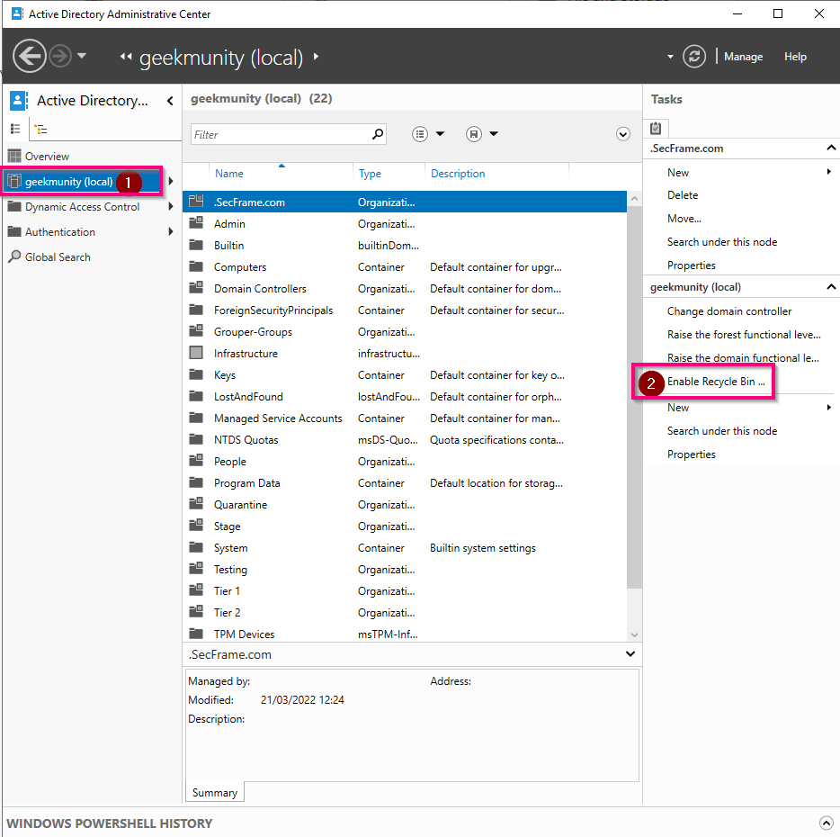

## USE RECYCLE BIN
* Go to the Active Directory Administrative Center.
* Select your domain (in my case geekmunity.local).
* Research "Deleteds object".

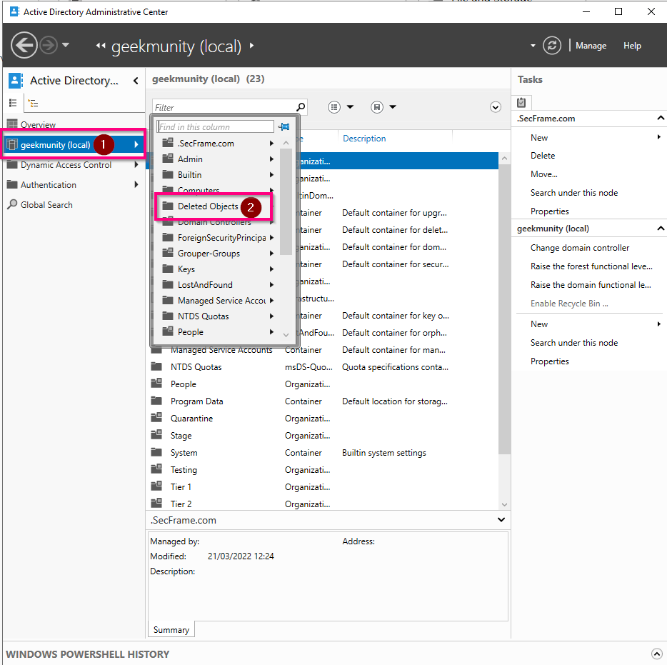

* Select the object to restore.
* Select "restore" (to put it back in its original place) or "restored to" (to put it back in the location of your choice).

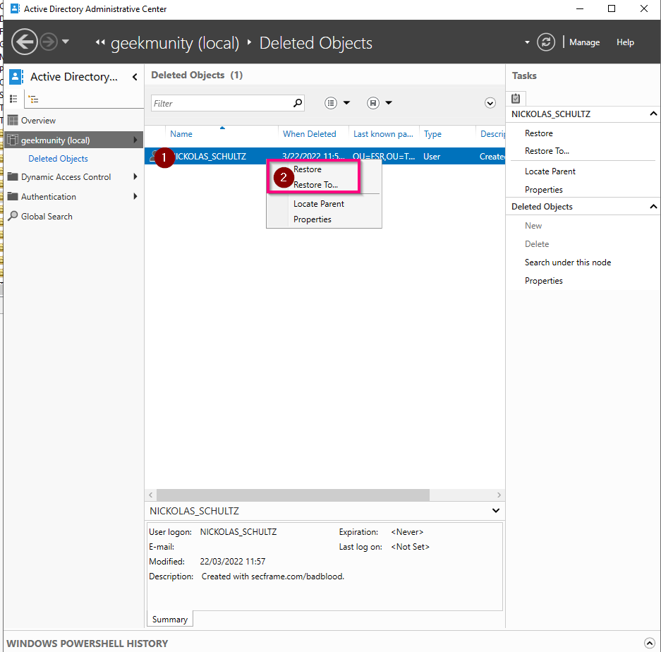

## RECYCLE BIN LIMITS
* The restoration of several objects must be done in a specific order. (highest object first).
* The recycle bin only keeps deleted objects in memory for a certain time.

> To change this delay in PowerShell : (Set-adobject -Server xxxx “cn=Directory Service,cn=Windows NT,cn=Services,cn=Configuration,dc=xxxx,dc=xxxx” -Replace @{‘tombstonelifetime’=”240″})

## RECYCLE BIN ADVANTAGES
* Available from Windows Server 2008.
* Simple and efficient graphical interface since 2012.

# CONCLUSION
Add software to AD, even if it's for backup:
* increases the attack surface and requires additional monitoring (updating the agent for example),
* often requires a service account which is often with a password that never expires and domain administrator

Although third-party backup software saves time, it is quite possible to do without if the budget is limited. it's better to put the money in protection software (antivirus, EDR, etc.) or off-site/off-line remote storage (export to tapes).

# Sources : 
* Wich AD restore: https://docs.microsoft.com/fr-fr/windows-server/identity/ad-ds/manage/ad-forest-recovery-determine-how-to-recover
* wbadmin: https://docs.microsoft.com/fr-fr/windows-server/administration/windows-commands/wbadmin
* ntds: https://www.windowstechno.com/what-is-ntds-dit/ 
* ldifde: https://docs.microsoft.com/en-us/previous-versions/windows/it-pro/windows-server-2012-R2-and-2012/cc731033(v=ws.11) 
* snapshot: https://www.technig.com/creating-active-directory-snapshots/
* UserAccountControl: https://docs.microsoft.com/fr-fr/troubleshoot/windows-server/identity/useraccountcontrol-manipulate-account-properties
