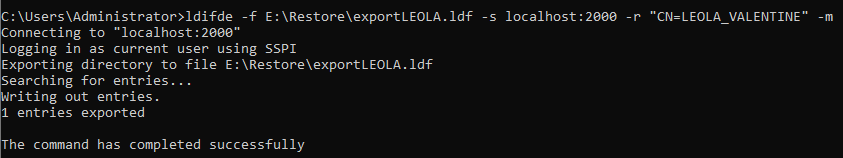

- [OBJET](#objet)
- [FONCTIONNALITE DE SAUVEGARDE](#fonctionnalite-de-sauvegarde)
  - [CREATION DE LA SAUVEGARDE](#creation-de-la-sauvegarde)
  - [CONTROLE DE LA SAUVEGARDE](#controle-de-la-sauvegarde)
  - [LISTER LES SAUVEGARDES DISPONIBLES](#lister-les-sauvegardes-disponibles)
  - [LISTER LE CONTENU DES SAUVEGARDES](#lister-le-contenu-des-sauvegardes)
  - [RESTAURATION NTDS](#restauration-ntds)
  - [OUVERTURE DU FICHIER NTDS](#ouverture-du-fichier-ntds)
  - [RESTAURATION VIA EXPORT](#restauration-via-export)
  - [LIMITE DE LA FONCTIONNALITE SAUVEGARDE](#limite-de-la-fonctionnalite-sauvegarde)
  - [AVANTAGES DE LA FONCTIONNALITE SAUVEGARDE](#avantages-de-la-fonctionnalite-sauvegarde)
- [SNAPSHOT](#snapshot)
  - [ACTIVER LES SNAPSHOTS](#activer-les-snapshots)
  - [CREER UN SNAPSHOT](#creer-un-snapshot)
  - [LISTER LES SNAPSHOTS DISPONIBLES](#lister-les-snapshots-disponibles)
  - [MONTER UN SNAPSHOT](#monter-un-snapshot)
  - [RESTAURER DEPUIS LE SNAPSHOT](#restaurer-depuis-le-snapshot)
  - [LIMITES DES SNAPSHOTS](#limites-des-snapshots)
  - [AVANTAGES DES SNAPSHOTS](#avantages-des-snapshots)
- [CORBEILLE](#corbeille)
  - [AJOUT DE LA CORBEILLE](#ajout-de-la-corbeille)
  - [UTILISER LA CORBEILLE](#utiliser-la-corbeille)
  - [LIMITES DE LA CORBEILLE](#limites-de-la-corbeille)
  - [AVANTAGES DE LA CORBEILLE](#avantages-de-la-corbeille)
- [CONCLUSION](#conclusion)
- [Sources :](#sources-)

# OBJET
Le but de cet article est de vous démontrer qu'il est tout à fait possible de sauvegarder et de restaurer un AD de façon granulaire sans dépenser des milliers en logiciels tiers de sauvegardes.
Les logiciels tiers ont des avantages, mais si vous avez une petite infrastructure ou un budget très limité, voyons comment faire.

# FONCTIONNALITE DE SAUVEGARDE
On commence par ajouter la fonctionnalité de sauvegarde.

## CREATION DE LA SAUVEGARDE
* Ouvrir l'invite de commande en administrateur.
* Saisir la commande : wbadmin start systemstatebackup -backuptarget:<Directory>

* Patienter

Pour un AD de plusieurs milliers d'objets, il faut compter une dizaine de minutes.

## CONTROLE DE LA SAUVEGARDE
* Se rendre dans le répertoire de sauvegarde, dans mon cas E:\WindowsImageBackup\NomServeur

* Se rendre dans le dossier Logs.
* Consulter le fichier Backup_Error.

> Avec ce fichier de logs, il est possible de générer des alertes en allant soit inspecter la taille soit le contenu.

## LISTER LES SAUVEGARDES DISPONIBLES
* Exécuter l'invite de commande en administrateur.
* Saisir la commande : wbadmin get versions

## LISTER LE CONTENU DES SAUVEGARDES
* Exécuter l'invite de commande en administrateur.
* webadmin get items -version:Versionidentifier

> On peut voir que notre sauvegarde comporte l'application Active Directory et le composant ntds, ce qui permet une restauration granulaire des objets.

> Comme nous avons fait une sauvegarde de l'état du système, il est possible de restaurer le serveur AD complétement via DSRM.

## RESTAURATION NTDS
* Exécuter l'invite de commande en administrateur.
* Saisir la commande : wbadmin start recovery -version:03/22/2022-19:43 -itemtype:App -items:AD -recoverytarget:E:\Restore\

Si on se rend dans le dossier de restauration, nous pouvons voir que le fichier ntds est bien restaurer.

## OUVERTURE DU FICHIER NTDS
Pour lire le fichier ntds nous allons le monter via la commande dsamain.

* Exécuter l'invite de commande en administrateur.
* Saisir la commande : dsamain -dbpath "E:\Restore\Active Directory\ntds\ntds.dit" -ldapport 2000

> Le port est libre, il faut juste en choisir un non utilisé sur le système pour éviter de possibles conflits.

* Ouvrir "Utilisateur et ordinateurs Active Directory".
* Sélectionner "changer le controleur de domaine".

* Saisir les informations de restauration précédemment fournies.

Le fichier est maintenant lisible, mais pas directement restaurable. Ça peut permettre en revanche de comparer les évolutions de comptes.

## RESTAURATION VIA EXPORT
Afin de restaurer un ou plusieurs comptes nous allons utiliser l'utilitaire LDIFDE.

* Exécuter l'invite de commande en administrateur.
* Saisir la commande : ldifde -f E:\Restore\exportLEOLA.ldf -s localhost:2000 -r "CN=LEOLA_VALENTINE" -m

Comme pour chaque restauration, nous allons rendre le compte inactif avant son ré-import.
Pour se faire :
* Ouvrir le fichier exportLEOLA.ldf.
* Modifier la ligne "userAccountControl: ".
* Attribuer la valeur 514.
* Exécuter l'invite de commande en administrateur.
* Saisir la commande : ldifde -i -f E:\Restore\exportLEOLA.ldf

Il ne reste maintenant plus qu'à changer le mot de passe du compte, car ce type de restauration génère un compte sans mot de passe.

## LIMITE DE LA FONCTIONNALITE SAUVEGARDE
* Peut s'avérer compliqué à l'utiliser en cas de grosse restauration.
* Ne sauvegarde pas tous les attributs des objets.
* Nécessite l'ajout de la fonctionnalité sauvegarde.

## AVANTAGES DE LA FONCTIONNALITE SAUVEGARDE
* Permet la restauration d'objets sur le même AD ou un autre (utile en cas d'incident).
* Permet la restauration complète de l'AD via le mode DSRM.

# SNAPSHOT
Présent depuis Windows Server 2008, la fonctionnalité snapshot est proche des snapshots dont on a l'habitude avec les VM.

## ACTIVER LES SNAPSHOTS
* Exécuter l'invite de commande en administrateur.
* Saisir : ntdsutil
* Saisir : activate instance ntds

## CREER UN SNAPSHOT
* Exécuter l'invite de commande en administrateur.
* Saisir : create

## LISTER LES SNAPSHOTS DISPONIBLES
* Exécuter l'invite de commande en administrateur.
* Depuis la même fenêtre, saisir : list all

## MONTER UN SNAPSHOT
* Exécuter l'invite de commande en administrateur.
* Saisir le snapshot à remonter (le numéro) : mount X

## RESTAURER DEPUIS LE SNAPSHOT
* Se rendre dans le dossier C:\$SNAP_DATE_VOLUMEC$\Windows\NTDS

On constate que le fichier ntds.dit est disponible, il ne reste donc qu'à refaire la même manipulation qu'au chapitre précédent pour réaliser la restauration.

## LIMITES DES SNAPSHOTS
* Nécessite de penser à faire les snapshots de façon régulières avant les modifications importantes.
* Comme pour la restauration via la fonctionnalité de sauvegarde, tous les attributs ne sont pas restaurés.

## AVANTAGES DES SNAPSHOTS
* Tous les outils sont installés par défaut.
* Permet de visualiser le contenu des snapshots.

# CORBEILLE
## AJOUT DE LA CORBEILLE
Bien que ce ne soit pas a proprement parlé une sauvegarde, la corbeille permet de restaurer au dernier état connu un objet supprimé de l'AD.

Pour l'ajouter : 
* Se rendre dans le centre d'administration Active Directory.
* Sélectionner votre foret (dans mon cas geekmunity.local).
* Sélectionner "Activer la corbeille".

## UTILISER LA CORBEILLE
* Se rendre dans le centre d'administration Active Directory.
* Sélectionner votre foret (dans mon cas geekmunity.local).
* Recherche "Objets supprimés".

* Sélectionner l'objet à restaurer.
* Sélectionner "restaurer" (pour le remettre à sa place initiale) ou "restauré à" (pour le remettre à l'emplacement de votre choix).

## LIMITES DE LA CORBEILLE
* La corbeille ne conserve en mémoire les objets supprimé qu'un temps.

> Pour modifier ce délai en PowerShell : (Set-adobject -Server xxxx “cn=Directory Service,cn=Windows NT,cn=Services,cn=Configuration,dc=xxxx,dc=xxxx” -Replace @{‘tombstonelifetime’=”240″})

* La restauration de plusieurs objets doit se faire dans un ordre bien précis. (objet le plus haut en premier).

## AVANTAGES DE LA CORBEILLE
* Disponible depuis Windows Server 2008.
* Aucun redémarrage nécessaire pour une restauration.
* Interface graphique simple et efficace depuis 2012.

# CONCLUSION
Ajouter un logiciel sur l'AD, quand bien même c'est pour la sauvegarde : 
* augmente la surface d'attaque et nécessite un suivi en plus (mettre à jour l'agent par exemple),
* nécessite souvent un compte de service qui est bien souvent avec un mot de passe qui n'expire jamais et administrateur de domaine

Bien que les logiciels tiers de sauvegarde permettent de gagner du temps, il est tout à fait possible de s'en passé si le budget est limité. il est plus intéressant de mettre l'argent dans des logiciels de protection (antivirus, EDR, etc.) ou un stockage distant hors site / non connecté (export sur bandes).

# Sources : 
* Déterminer l'AD à restaurer : https://docs.microsoft.com/fr-fr/windows-server/identity/ad-ds/manage/ad-forest-recovery-determine-how-to-recover
* WBADMIN : https://docs.microsoft.com/fr-fr/windows-server/administration/windows-commands/wbadmin
* ntds : https://www.windowstechno.com/what-is-ntds-dit/
* ldifde : https://docs.microsoft.com/en-us/previous-versions/windows/it-pro/windows-server-2012-R2-and-2012/cc731033(v=ws.11)
* snapshot : https://www.technig.com/creating-active-directory-snapshots/
* UserAccountControl : https://docs.microsoft.com/fr-fr/troubleshoot/windows-server/identity/useraccountcontrol-manipulate-account-properties
